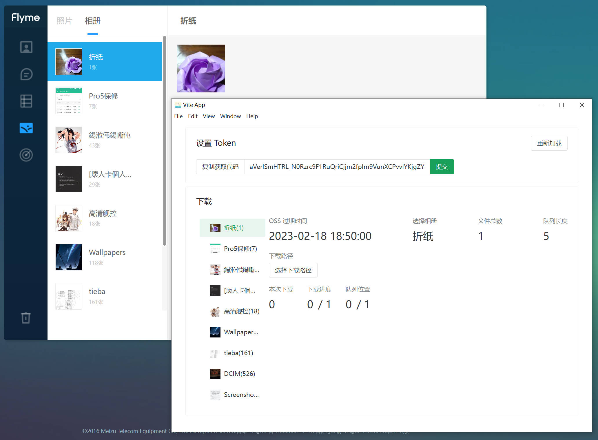

# MPCB  
MPCB(meizu photo cloud backup)  

魅族云相册备份下载器， 简高效的批量下载魅族云相册中的图片。  

详细使用文档：  
https://pyumch0w0j.feishu.cn/docx/doxcn3KgDeFOKy5anFiOYmtqexc

国内镜像地址:  
蓝奏云：  
https://moreant.lanzoul.com/b01cpng1e  密码:fedu  

## 特别鸣谢
感谢 @caoxiemeihao 及他的 electron-vite-vue 模板，开箱即用。

## 更新日志
### 0.3.0 
1. 图片最多获取 10,000 张改为 20,000 张。
2. 更新相关依赖。

### 0.2.1
1. 使用 Electron 简化程序安装。
2. 使用 NaiveUI 重构 UI。
3. 能从指定位置开始下载图片，缓解 Token 过期导致下载失败。
4. 简化获取 Token 的方式。

### 0.1.0
1. 使用 daisyui 与 nodejs 实现基本功能
2. 使用浏览器脚本插件获取 Token

## 工具
支持生成 521 尺寸 icon 的网站 https://redketchup.io/icon-converter