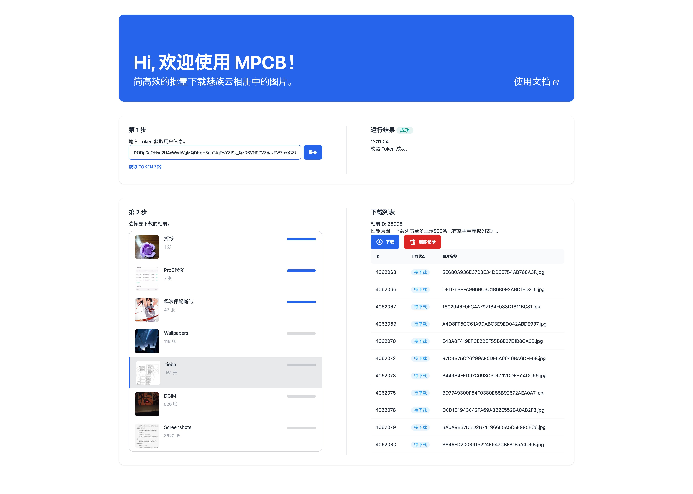

# MPCB

MPCB(meizu photo cloud backup)  
魅族云相册备份下载器  
简高效的批量下载魅族云相册中的图片



## 使用方法

0. 首先你的电脑需要装有 `Nodejs`。
1. 克隆或下载整个仓库，找个文件夹解压文件。
2. 分别进入 backend 和 frontend 文件夹，在 终端/bash/powershell/cmd 中执行以下指令安装依赖：

```
npm i
```

3. 在终端中进入 backend 文件夹，执行以下指令运行后端程序：

```
node index.js
```

控制台中显示 `listening on port 3005` 则启动成功。

4. 另起一个终端，在 forntend 文件夹中执行以下指令运行前端程序：

```
npm run dev
```

控制台中有显示 `Local: http://localhost:3000/` 则启动成功，访问这个地址即可开始备份照片。

## Q&A

0. Q: Nodejs 是什么，我有装有吗？  
   A: 请在终端中执行 `node -v` 这个指令检查是否装有 node. 如果没有，请按照这个教程进行安装 [安装 Node](https://www.runoob.com/nodejs/nodejs-install-setup.html)。

1. Q: 下载的图片去哪了？  
   A: 在 `backend/down/` 中，一个相册 ID 对应一个文件夹。

2. Q: 怎么下载异常了？  
   A: 可能是 Token 过期了，需要重新获取，提交。

3. Q: 怎么下载不全？  
   A: 你的相册超过 1 万条了？
